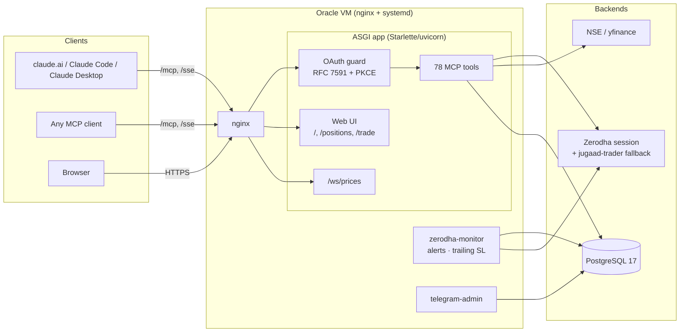

# Zerodha Personal MCP Server

[](LICENSE)
[](pyproject.toml)
[](https://modelcontextprotocol.io)

A remote [Model Context Protocol](https://modelcontextprotocol.io) server for a personal Zerodha
trading account. Gives Claude (or any MCP client) live access to portfolio, NSE market data,
technical analysis, trade planning, options analytics, a trade journal, and a web UI for
order entry and live positions — **no paid Kite Connect subscription required**.

> ### ⚠️ Real money. Read this first.
>
> This connects to a **live Zerodha brokerage account** and can **place, modify, and cancel
> real orders with real money**. It authenticates by using the same session Zerodha's own web
> app (`kite.zerodha.com`) uses, rather than the official paid Kite Connect API — this is an
> **unofficial integration** that may break, or fall out of step with Zerodha's terms, if they
> change their web client.
>
> Nothing this server produces is financial advice. Analysis tools return *structural
> descriptors* (e.g. "price is above its 20-day average"), not directional predictions — see
> [Research findings](#research-findings) below, including a negative result from testing the
> server's own regime-detection logic.
>
> Provided **as-is, with no warranty** (see [LICENSE](LICENSE)). You are solely responsible for
> every order placed through it and for any resulting gain or loss. Try it against a small
> position size or a fresh account first.

---

## Why it exists

Kite Connect, Zerodha's official trading API, costs ₹2,000/month. This project instead
authenticates the same way Zerodha's own web app does, and layers a full MCP tool surface —
plus a self-hosted web UI — on top, for free.

| Layer | What runs | Data source |
|---|---|---|
| Auth + portfolio | Direct HTTPS to `kite.zerodha.com`, `jugaad-trader` fallback | Your personal Zerodha account |
| Live NSE quotes, option chains | `jugaad-data` NSELive | NSE public market feed (free) |
| Historical OHLCV | Yahoo Finance (`yfinance`) | Free, no account needed |
| Instrument search | NSE public `EQUITY_L.csv` | Free |

---

## Architecture



Full auth-flow detail (OAuth discovery, PKCE, the three identity states) and the module map
are in [ARCHITECTURE.md](ARCHITECTURE.md).

---

## What makes it different

**Trust metadata envelope.** Every tool response is wrapped with a type label
(`FACT` / `INDICATOR` / `INTERPRETATION`), a validation status, a data-quality flag, and
market-hours state — so a model consuming these tools can't mistake a structural descriptor
("price is above its 20-day average") for a directional signal. See
[`src/meta.py`](src/meta.py) and [Tool response format](#tool-response-format).

**Real OAuth 2.0, not an API-key shim.** RFC 7591 dynamic client registration, PKCE, and the
`/.well-known/oauth-authorization-server` / `/.well-known/oauth-protected-resource` discovery
endpoints, so `claude.ai` and other OAuth-aware MCP clients connect with a login popup, not a
pasted token. Three identity states — authenticated, guest, anonymous — with guest queries
row-level isolated at the database layer (`_user_filter()` returns `WHERE 1=0` for guests, not
an application-level check that can be bypassed).

**A negative result, published rather than buried.** A walk-forward audit
([`scripts/regime_audit.py`](scripts/regime_audit.py)) tested the server's own EMA20/EMA50 +
ADX regime-detection logic against 2022–2025 NSE data and found it has **no demonstrated
directional edge** — see [Research findings](#research-findings). That finding is embedded
directly in the relevant tool docstrings, so the model using them is told the limitation at
the point of use, not left to assume a working signal exists.

**A production deployment that has actually run.** Oracle Cloud VM, PostgreSQL 17, three
systemd units (`zerodha-mcp`, `zerodha-monitor`, `telegram-admin`), Alembic migrations gated
before service restart, an idempotent nginx WebSocket config patcher, a daily backup timer,
and a one-command rollback script. See [`infra/`](infra/) and
[`.github/workflows/deploy.yml`](.github/workflows/deploy.yml) — the latter's comments record
two real production incidents and how the pipeline was hardened against each.

---

## Quick start

```bash
git clone https://github.com/Saivishnu1/trading-mcp.git
cd trading-mcp
cp .env.example .env      # fill in ZERODHA_USER_ID / PASSWORD / TOTP_SECRET

uv sync
uv run zerodha-mcp        # -> http://localhost:8000
```

Or with Docker: `docker compose up -d`.

Open `http://localhost:8000/login` to authenticate (credentials are entered directly into the
server's own login page — see [Connecting an MCP client](#connecting-an-mcp-client) for why
that matters), or click **Continue as guest** for immediate access to the 50+ tools that don't
need a Zerodha session at all.

Full credential walkthrough (where to find your Client ID, password, and TOTP secret):
[`docs/CREDENTIALS.md`](docs/CREDENTIALS.md).

---

## Connecting an MCP client

The server has **two access tiers** — market data, technicals, options, and dashboards work
for anyone as a guest; portfolio, orders, journal, and recommendations require a full Zerodha
login. Credentials never pass through the agent: the `zerodha_login()` tool returns a URL, you
authenticate directly on the server's own page, and only a Bearer token comes back into the
client.

**claude.ai** — Settings → Integrations → Add MCP Server → paste
`https://140-245-202-88.sslip.io/mcp`. A login popup appears automatically (OAuth 2.0 + PKCE);
choose "Continue as guest" or sign in for full access.

**Claude Code** —
```bash
claude mcp add --transport http zerodha https://140-245-202-88.sslip.io/mcp \
  --header "Authorization: Bearer <your-api-key>"
```

**Claude Desktop** — add to `claude_desktop_config.json`:
```json
{ "mcpServers": { "zerodha": {
  "url": "https://140-245-202-88.sslip.io/sse",
  "headers": { "Authorization": "Bearer <your-api-key>" }
} } }
```

Any other MCP-compatible client (Cursor, Postman, a custom agent loop) works the same way —
`/mcp` for Streamable HTTP, `/sse` for legacy SSE. Full walkthrough for every client, plus the
guest-vs-full-login flow in detail: [`docs/OPERATIONS.md`](docs/OPERATIONS.md).

---

## Tools

**78 tools**, grouped by domain:

| Domain | Examples |
|---|---|
| Portfolio & broker | holdings, positions, margins, multi-broker abstraction |
| Market data | quotes, OHLC, LTP, historical candles |
| Options & derivatives | option chains, PCR, max pain, OI analysis |
| Technicals | RSI, EMA, MACD, ADX, ATR |
| Analysis | market-structure descriptors, trade setups, regime alignment |
| Trade journal & calibration | log/close trades, performance analytics, Brier score |
| Trade recommendations & sizing | portfolio-aware ENTER/WAIT/AVOID, position sizing |
| Market & portfolio intelligence | VIX, global pulse, event risk, exposure breakdown |
| Order execution & monitoring | order placement, trailing stop-loss, live alerts |
| Charts | price/indicator/option chart image generation |

Full tool-by-tool reference with signatures: [`docs/TOOLS.md`](docs/TOOLS.md).

---

## Tool response format

Every tool response carries the trust metadata envelope described above:

```json
{
  "data": { "...actual output..." },
  "meta": {
    "type": "FACT | INDICATOR | INTERPRETATION",
    "validation": { "status": "VERIFIED | MATHEMATICALLY_COMPUTED | UNVALIDATED", "backtested": false },
    "data_quality": "VALID | NaN_DETECTED | STALE | INVALID",
    "market_hours": true,
    "source": "yfinance | NSELive | internal_journal",
    "as_of": "2026-09-01T08:00:00Z"
  }
}
```

---

## Tech stack

| | |
|---|---|
| Runtime | Python 3.12–3.13, Starlette/uvicorn (raw ASGI, no framework) |
| Broker | `httpx` primary, `jugaad-trader` fallback |
| Market data | `jugaad-data` (NSE live), `yfinance` (historical) |
| Persistence | PostgreSQL 17 + SQLAlchemy async + Alembic (prod); Turso/libSQL (alt) |
| Charts | `matplotlib` / `mplfinance` → PNG |
| Web UI | Hand-rolled HTML/CSS/JS, no build step, no framework |
| Packaging | `hatchling` + `uv` |

---

## Development

```bash
make install     # uv sync
make test        # uv run pytest
make lint        # ruff check
make typecheck   # mypy src
make check       # everything CI runs
```

~2,600 tests, 12–30s. See [`docs/OPERATIONS.md`](docs/OPERATIONS.md) for switching broker
backends, session lifetime / re-login automation, and environment variable reference.

---

## Deployment

Production runs on an Oracle Cloud VM: PostgreSQL 17, three systemd services, and a
push-to-`main` CI/CD pipeline that runs the test suite, SSHes in, runs migrations, and
restarts services with a health check. See [`infra/README.md`](infra/README.md) for the full
setup and [`docs/OPERATIONS.md`](docs/OPERATIONS.md) for local Docker Compose.

---

## Research findings

Two research phases tested the server's own analysis tools for directional edge on NSE data
and found none:

- **Regime classifier walk-forward audit** (2022–2025, Nifty 50) — the EMA20/EMA50 + ADX
  regime engine does not demonstrate directional predictive value; monotonicity across regime
  buckets was violated.
- **Cross-sectional momentum screen** (Nifty 50, 968 dates, 46,464 observations) — no large,
  stable, tradeable momentum edge found across 6- and 12-month lookbacks.

As a result: `detect_market_regime` and `generate_trade_setup` return structural facts and
reference levels, not predictions or confidence scores — those fields were removed entirely
rather than left in with a caveat. The audit scripts are kept in [`scripts/`](scripts/) for
evaluating future models against the same bar.

---

## Limitations

| Feature | Status |
|---|---|
| F&O / MCX instrument dump | NSE equity list only; symbol search covers most lookups |
| Intraday history older than 60 days | Use `interval="1d"` for full daily history |
| BSE instrument list | Use `search_instruments(exchange="BSE")` or a raw yfinance ticker |
| Directional trade signals | Intentionally not provided — see Research findings above |

---

## License

[MIT](LICENSE) — provided as-is, see the risk disclaimer above.
